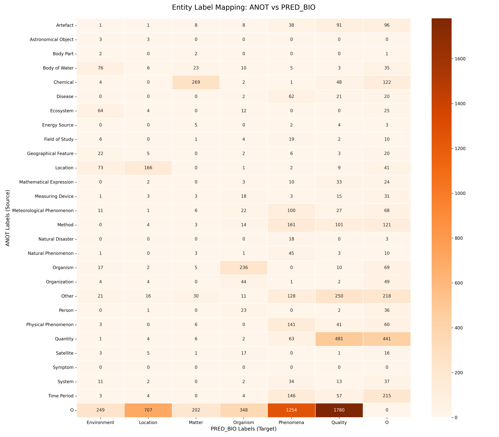
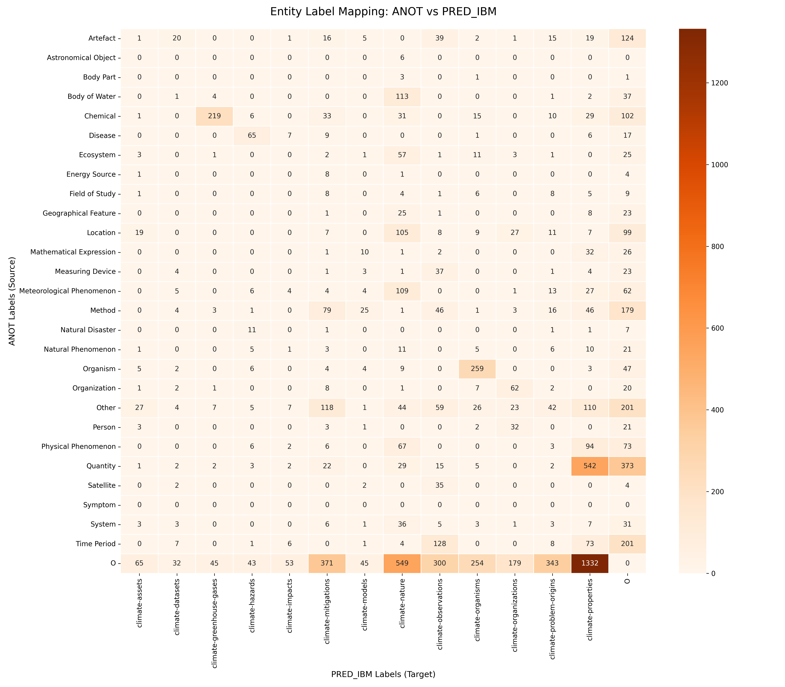

# Datasets Overlap

*1.* - The most critical finding is that the current annotation schema has a significant gap. Analysis of the "Other" class reveals the need to **add a new class similar to IBM's "climate-assets"** to properly categorize entities of value to humans that are affected by climate change, such as crops, infrastructure, and public health.

*2.* - The fine-tuning analysis provides a clear roadmap for simplifying the schema and integrating data from other sources. It identifies several **directly equivalent classes** (e.g., your 'Chemical' is their 'Matter') and shows that many of your granular classes (like 'Natural Disaster' or 'Quantity') could be **merged into broader parent categories** (like 'Phenomena' or 'Quality') that exist in the other datasets.

## Case-Invariant Match Based Overlap
This section summarizes the results regarding overlapping entity types from BioDivNER, Climate-Change-NER (IBM), ClimateIE and ours (CWED4ETA) based on [parse_ccner_datasets](/CWED4ETA/parse_ccner_datasets.ipynb).

### Observations
*   **Results regarding our "Other" class:**
    *   In **BIODIVNER**, the majority of our "Other" class is unmapped (96.69%) with some overlap with:
        *   BIODIVNER "Quality" (2.86%): *data parameters measured or observed, phenotypesand traits*. This mostly includes adjectives ("dry", "dead"), structure ("chemical composition", "structure", "spatial distribution") and other. The "Quality" class from BIODIVNER seems to be their "Other" class, which is very diverse.
        *   BIODIVNER "Environment" (1.50%): *Natural or man-made environments ORGANISM live in*. This is mostly terms related to the living area of organisms ("soil", "ground") or terms related to organisms in general ("community", "species").
    *   In **IBMCCNER**, the majority of our "Other" class is unmapped (95.19%) with some overlap with:
        *   IBMCCNER "climate-assets" (2.41%): *objects or services of value to humans that can get destroyed or diminished by climate-hazards. Key categories are health, buildings, infrastructure, and crops or livestock.* This mostly includes terms related to inventory or wellbeing of humans ("health", "residential", "rice", "water supply", "homes", "crop", "welfare").
    *   In **ClimateIE**, the majority of our "Other" class is unmapped (97.29%) with some overlap with:
        *   ClimateIE "variable" (2.41%): *represents a specific measurable element or attribute of the climate system that is studied or monitored (e.g., cloud cover, temperature (i.e., surface air, ocean, or groundwater), precipitation, wind speed, vapor pressure, geopotential height, humidity (relative, specific) etc.* This is mostly terms that are related to climate and can be measured in some fashion, but are mostly abstract ("land use change", "primary production", "water resources", "anthrophogenic activities", "spatial patterns") or directly measurable ("cloud properties", "population").

### Conclusions
*   The "climate-assets" class from IBMCCNER should be added to our schema (with a better name).
*   When looking at mappings of entities to all our (CWED4ETA) classes, IBMCCNER "climate-assets" still has the highest percentage of entities mapped specifically to our "Other" class, which suggests that we are in fact missing a "climate-assets" type of class.

## Fine-Tuning Based Overlap
This section summarizes the results regarding overlapping entity types from BiodivNER, Climate-Change-NER (IBM) and ours (CWED4ETA). The overlap is based on fine-tuned model predictions. Specifically, GLiNER fine-tuned on BiodivNER (BiodivNER_GLiNER_v2_1), GLiNER fine-tuned on Climate-Change-NER (IBMCCNER_GLiNER_v2_1) and our manual annotations (CWED4ETA).

The common data used to calculate the overlap is 50 sample papers that we currently use for manual annotation. The main goal of this is to determine possible classes to merge.

### Comparison: Ours and BiodivNER

### Observations
*   Fine-tuning (for only 10 epochs) did not yield admirable results for BiodivNER. Although there is improvement from the not-fine-tuned GLiNER version (12% on average), the F1 score still spans from 10% to 62% ([../PLOTS/GLiNER_med_v2_1_BIODIVNER_PURE_PETF1S_strict.png](../PLOTS/GLiNER_med_v2_1_BIODIVNER_PURE_PETF1S_strict.png)) with a 34.5% average, depending on the class.
*   **Potential Mappings (Likely Equivalent Concepts):**
    *   'Chemical' (ANOT) <--> 'Matter' (PRED_BIO) (83.0% forward, 72.5% backward)
    *   'Location' (ANOT) <--> 'Location' (PRED_BIO) (66.1% forward, 71.2% backward)
*   **ANOT Labels that are Likely Subsets of PRED_BIO Labels:**
    *   'Disease' (ANOT) --> 'Phenomena' (PRED_BIO) (72.9%)
    *   'Ecosystem' (ANOT) --> 'Environment' (PRED_BIO) (80.0%)
    *   'Mathematical Expression' (ANOT) --> 'Quality' (PRED_BIO) (68.8%)
    *   'Natural Disaster' (ANOT) --> 'Phenomena' (PRED_BIO) (100.0%)
    *   'Natural Phenomenon' (ANOT) --> 'Phenomena' (PRED_BIO) (84.9%)
    *   'Organism' (ANOT) --> 'Organism' (PRED_BIO) (87.4%)
    *   'Organization' (ANOT) --> 'Organism' (PRED_BIO) (80.0%)
    *   'Person' (ANOT) --> 'Organism' (PRED_BIO) (88.5%)
    *   'Physical Phenomenon' (ANOT) --> 'Phenomena' (PRED_BIO) (73.8%)
    *   'Quantity' (ANOT) --> 'Quality' (PRED_BIO) (86.4%)
    *   'Time Period' (ANOT) --> 'Phenomena' (PRED_BIO) (68.2%)

### Comparison: Ours and Climate-Change-NER

### Observations
*   **Potential Mappings (Likely Equivalent Concepts):**
    *   'Organism' (ANOT) <--> 'climate-organisms' (PRED_IBM) (88.7% forward, 73.4% backward)
*   **ANOT Labels that are Likely Subsets of PRED_IBM Labels:**
    *   'Astronomical Object' (ANOT) --> 'climate-nature' (PRED_IBM) (100.0%)
    *   'Body Part' (ANOT) --> 'climate-nature' (PRED_IBM) (75.0%)
    *   'Body of Water' (ANOT) --> 'climate-nature' (PRED_IBM) (93.4%)
    *   'Disease' (ANOT) --> 'climate-hazards' (PRED_IBM) (73.9%)
    *   'Ecosystem' (ANOT) --> 'climate-nature' (PRED_IBM) (71.2%)
    *   'Energy Source' (ANOT) --> 'climate-mitigations' (PRED_IBM) (80.0%)
    *   'Geographical Feature' (ANOT) --> 'climate-nature' (PRED_IBM) (71.4%)
    *   'Mathematical Expression' (ANOT) --> 'climate-properties' (PRED_IBM) (69.6%)
    *   'Measuring Device' (ANOT) --> 'climate-observations' (PRED_IBM) (72.5%)
    *   'Natural Disaster' (ANOT) --> 'climate-hazards' (PRED_IBM) (78.6%)
    *   'Organization' (ANOT) --> 'climate-organizations' (PRED_IBM) (73.8%)
    *   'Person' (ANOT) --> 'climate-organizations' (PRED_IBM) (78.0%)
    *   'Quantity' (ANOT) --> 'climate-properties' (PRED_IBM) (86.7%)
    *   'Satellite' (ANOT) --> 'climate-observations' (PRED_IBM) (89.7%)
*   **PRED_IBM Labels that are Likely Subsets of ANOT Labels:**
    *   'climate-greenhouse-gases' (PRED_IBM) --> 'Chemical' (ANOT) (92.4%)
