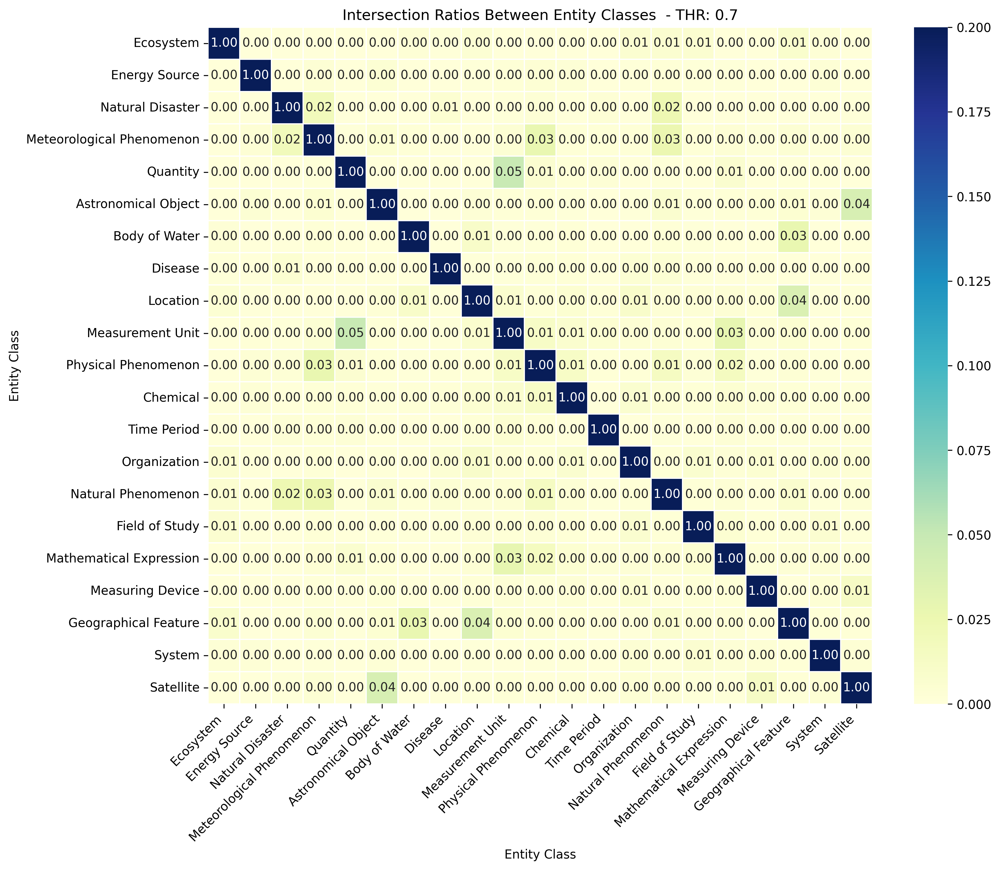
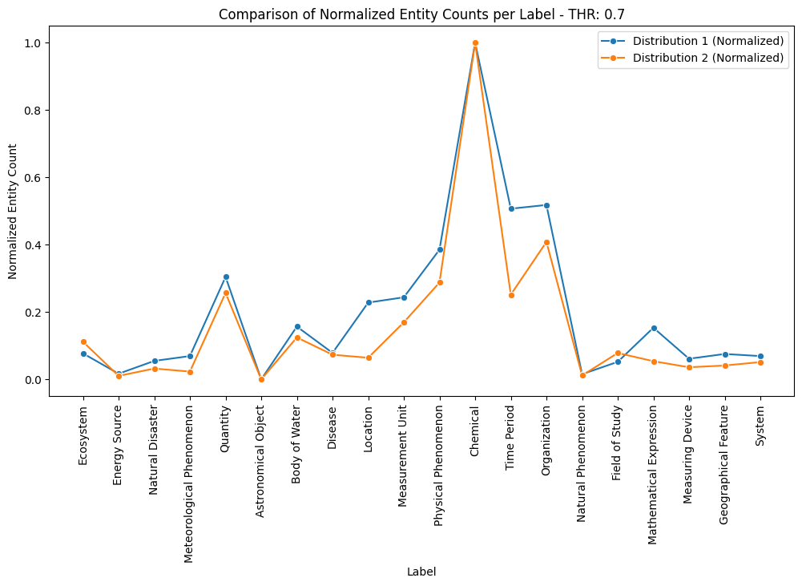

# GLiNER label report 10.3.2025.

## NER Types
```
Ecosystem
Energy Source
Natural Disaster
Meteorological Phenomenon
Quantity
Astronomical Object
Body of Water
Disease
Location
Measurement Unit
Physical Phenomenon
Chemical
Time Period
Organization
Natural Phenomenon
Field of Study
Mathematical Expression
Measuring Device
Geographical Feature
System
Satellite
```

| NER type                  	| Wikidata Item                                             	| Wikidata ID                 	|
|---------------------------	|-----------------------------------------------------------	|-----------------------------	|
| Ecosystem                 	| ecosystem                                                 	| Q37813                      	|
| Energy Source             	| energy source                                             	| Q1522115                    	|
| Natural Disaster          	| natural disaster                                          	| Q8065                       	|
| Meteorological Phenomenon 	| type of meteorological phenomenon                         	| Q118733587                  	|
| Quantity                  	| physical quantity                                         	| Q107715                     	|
| Astronomical Object       	| astronomical object type                                  	| Q17444909                   	|
| Body of Water             	| body of water                                             	| Q15324                      	|
| Disease                   	| class of disease                                          	| Q112193867                  	|
| Location                  	| geographic region, geographic location, geographic entity 	| Q82794, Q2221906, Q27096213 	|
| Measurement Unit          	| SI unit                                                   	| Q61610698                   	|
| Physical Phenomenon       	| physical phenomenon                                       	| Q1293220                    	|
| Chemical                  	| structural class of chemical entities                     	| Q47154513                   	|
| Time Period               	| time interval                                             	| Q186081                     	|
| Organization              	| organization                                              	| Q43229                      	|
| Natural Phenomenon        	| natural phenomenon                                        	| Q1322005                    	|
| Field of Study            	| academic discipline                                       	| Q11862829                   	|
| Mathematical Expression   	| mathematical expression                                   	| Q6498784                    	|
| Measuring Device          	| measuring instrument                                      	| Q2041172                    	|
| Geographical Feature      	| geographical feature                                      	| Q618123                     	|
| System                    	| system                                                    	| Q58778                      	|
| Satellite                 	| artificial satellite                                      	| Q26540                      	|


## Analysis on the results (FDEL, threshold=0.7) - 10 paper sample

- Run GLiNER on 10 papers with `threshold=0.05` to see threshold sensitivity: 
``` shell
5_106710_Pancreatic_islet_amyloidosis,_β-cell_apoptosis,_and_α-cell_proliferation_are_determinants_of_islet_remodeling_in_type-2_diabetic_baboons.json
5_136161_On_the_nature_of_a_glassy_state_of_matter_in_a_hydrated_protein:_Relation_to_protein_function.json
5_138512_Honor_thy_symbionts.json
5_146805_Root-specific_camalexin_biosynthesis_controls_the_plant_growth-promoting_effects_of_multiple_bacterial_strains.json
5_165860_Conversion_of_Th2_memory_cells_into_Foxp3+_regulatory_T_cells_suppressing_Th2-mediated_allergic_asthma.json
5_28903_Influences_of_the_Runoff_Partition_Method_on_the_Flexible_Hybrid_Runoff_Generation_Model_for_Flood_Prediction.json
5_31254_Conceptualisation_of_an_Ecodesign_Framework_for_Sustainable_Food_Product_Development_across_the_Supply_Chain.json
5_58555_On_the_Epochal_Strengthening_in_the_Relationship_between_Rainfall_of_East_Africa_and_IOD.json
5_82785_Inuence_of_landscape_heterogeneity_on_water_available_to_tropical_forests_in_an_Amazonian_catchment_and_implications_for_modeling_drought_response.json
```
- Default threshold is 0.5 -> After manual examination of the results we decide to use **0.7 for all further experiments**. (NOTE: Values between 0.5 and 0.75 give reasonable results.)
- Results:


#### Ecosystem
- *community of living organisms together with the nonliving components of their environment, interacting as a system*
- Top 7: 
	- plants, 
	- **TROPICAL FOREST**, 
	- **tropical forest**, 
	- **intestinal ecosystem**, 
	- **microbiota**, 
	- **tropical forests**, 
	- Col-0 plants
- Mostly correct (5/7)
- **KEEP**

#### Energy Source
- *physical or chemical phenomenon from which one can extract energy*
- Top 7:
  - **energy**
  - U.S. Depertment of Energy
  - 
  - **fuel**
  - **renewable sources of energy**
  - **non-renewable energy**
  - **renewable energies**
- Mostly correct (5/7) (NOTE: Definition is a little bit poor)
- **KEEP**

#### Natural Disaster
- *major adverse event resulting from natural processes of the Earth, which may cause loss of life or property*
- Top 7:
  - **droughts**
  - **flood events**
  - **drought**
  - **floods**
  - WTD
  - **extreme rainfall events**
  - flood season
- Mostly correct (5/7)
- **KEEP**

#### Meteorological Phenomena
- *metaclass; instances of this item are classes representing common weather phenomena ;; phenomenon that takes place in the atmosphere*
- Top 7:
  - **atmospheric forcing**
  - **subsurface stormflow**
  - **short rains**
  - P-ET
  - WTD
  - **precipitation**
  - **long rains**
- Mostly correct (5/7) (NOTE: P-ET should be a mathematical expression or quantity, similar for WTD)
- **KEEP**

#### Quantity
- *quantitative characterization of an aspect of a physical entity, phenomenon, event, process, transformation, relation, system, or substance*
- Top 7:
  - **steady infiltration rate**
  - **n**
  - **transcript levels**
  - **1**
  - **2**
  - **172 accessions**
  - **relative B-cell volume**
- Mostly correct (~5/7) (NOTE: entites like n, 1, and 2 are useless)
- **KEEP**

#### Astronomical Object
- *physical body of astronomically-significant size, mass, or role, naturally occurring in a universe*
- Top 7:
  - Mercury 
  - ITCZ
- Loosely correct (1/2)
- **KEEP**

#### Body of Water
- *any significant accumulation of water, generally on a planet's surface*
- Top 7:
  - **water**
  - water table
  - **Indian Ocean**
  - **Xun River basin**
  - **Water**
  - groundwater table
  - supercooled water
- Mostly correct (4/7) (NOTE: All inccorect instances contain the word water.)
- **KEEP**

#### Disease
- *disease as a first-order metaclass. To be used as P31 values for all disease classes. Its instances are classes (e.g., cancer)*
- Top 7:
  - **T2DM**
  - **IA**
  - **hyperglycemia**
  - **eosinophilia**
  - pathogens
  - **islet amyloidosis**
  - **leaf pathogens**
- Correct (6/7) (NOTE: Some instances are more of a condition then disease.)
- **KEEP**

#### Location
- *point, line or area on or near Earth ;; 2D or 3D defined space on something, mainly in terrestrial and astrophysics sciences ;; relatively stationary place or entity that can be geographically identified, located, or described*
- Top 7:
  - **Germany**
  - **East Africa**
  - lung
  - **Cologne**
  - spleen
  - BALF
  - **Boston**
- Mostly correct (4/7) (NOTE: inccorect terms are mostly body parts)
- **KEEP**


#### Measurement Unit
- *unit in the International System of Units*
- Top 7:
  - r
  - 160 K
  - 180 K
  - **mm**
  - partial r
  - 200 K
  - **atomic resolution**
- Mostly inccorect (2/7) (NOTE: Should be merged with Quantity)
- **DISCARD**

#### Physical Phenomenon
- *phenomenon of the material world*
- Top 7:
  - **runoff**
  - **surface runoff**
  - lateral flow
  - WTD
  - subsurface runoff
  - FPG
  - **evapotranspiration**
- Mostly inccorect (~3/7) (NOTE: Correct terms are vaguely in this category, this category should be merged or discarded.)
- **MERGE/DISCARD**

#### Chemical
- *set of chemical entities sharing a common structural feature to which is attached a variable part (or parts) defining a specific entity of the class ;; species of atoms having the same number of protons in the atomic nucleus and the same chemical properties, but not necessarily the same mass, or the same stability (or half-lifetime if they are unstable)*
- Top 7:
  - **camalexin**
  - **CYP71A27** -
  - **TGF-beta** -
  - **IL-4** -
  - **rapamycin**
  - **CYP71A12**
  - **insulin** -
- Mostly correct (~5/7) (NOTE: Most of chimcals are commplex chemical compounds and enzyms.)
- **KEEP/RECONSIDER**

#### Time Period
- *temporal extent having a beginning, an end and a duration*
- Top 7:
  - **dry season**
  - **1961**
  - **1997**
  - **epochs**
  - **last epoch**
  - **November**
  - **wet season**
- Mostly correct (~7/7) (NOTE: Time Period includes a single year as well as longer periods such as epoch.)
- **KEEP**

#### Organization
- *social entity established to meet needs or pursue goals*
- Top 7:
  - B. thetaiotaomicron
  - ALM
  - **National Institutes of Health**
  - B. distasonis
  - **SSRL**
  - Bifidobacterium longum
  - Pseudomonas sp. CH267
- Mostly incorrect (2/7) (NOTE: Most incorrect terms are bacteria and smaller living beings -> New category should be added.)
- **DISCARD/RECONSIDER**

#### Natural Phenomenon
- *observable phenomenon which is not human-made*
- Top 7:
  - FPG
  - Anistropy
  - crambin crystals
  - **E373Q variation**
  - amyloid deposition
  - **eutrophication**
  - ecotoxicity
- Mostly incorrect (2/7) 
- **DISCARD/RECONSIDER**

#### Field of Study
- *academic field of study or profession ;; field limited to a specific area of ​​knowledge; specialization in an occupation or branch of learning; a specific use*
- Top 7:
  - **hydrological modelling**
  - PNAS
  - **Earth system models**
  - **ecodesign**
  - **climate models**
  - **ecological theory**
  - genome scientists
- Mostly correct (~5/7)
- **KEEP**

#### Mathematical Expression
- *formula that represents a mathematical object ;; abstract entity in mathematics*
- Top 7:
  - **infiltration equation**
  - **beta**
  - Student's t test
  - **Green-Ampt formula**
  - terrain following grid method
  - **Darcy's law**
  - soil properties
- Mostly correct (4/7) (NOTE: Incorrect instances are methods or properties.)
- **KEEP**

#### Measuring Device
- *device for measuring a physical quantity*
- Top 7:
  - **diode array detector**
  - solvent degasser
  - **MAR Research imaging plate detector**
  - Phenomenex Gemini analytical column
  - Phenomenex Gemini column
  - **Voyager DR Pro spectrometer**
  - **hewlett packard diode array spectrophotometer**
- Mostly correct (4/7)
- **KEEP**

#### Geographical Feature
- *components of planets that can be geographically located*
- Top 7:
  - **plateau**
  - topography
  - **valley**
  - major groove
  - surface topography
  - **Amazon Basin**
  - **slope**
- Mostly Correct (4/7)
- **KEEP**

#### System
- *set of interacting or interdependent components*
- Top 7:
  - **hybrid two-component systems**
  - **protein-water system**
  - ParFLow
  - Common Land Model
  - Earth system models
  - SIMTOP scheme
  - **Milipore Miliq purification system**
- Mostly incorrect (3/7)
- **RECONSIDER**

#### Satellite
- *human-made object put into an orbit*
- Top 7:
  - shuttle radar topography mission
  - **MODIS**
  - Eden-1
  - **satellite**
- Mostly correct (2/4)
- **KEEP/RECONSIDER**

### Conclusion

**GOOD**: Ecosystem, Energy Source, Natural Disaster, Meteorological Phenomena, Astronomical Object, Body of Water, Time Period, Field of Study, Measuring Device, Geographical Feature, Satellite

**MERGE/RECONSIDER**: Quantity, Disease, Location, Physical Phenomenon, Chemical, Organization, Natural Phenomenon, Mathematical Expression, System

**DISCARD**: Measurement Unit

**Observations:**
1. Meteorological Phenomena: Some detected terms are quantities or mathematical expressions ("P-ET should be a mathematical expression or quantity, similar of WTD")
2. Quantity: Some detected terms are useless. ("entites like n, 1, and 2 are useless")
3. Disease: Some detected terms could be interpreted as symptoms/conditions rather then a disease. ("Some instances are more of a condition then disease.")
4. Location: Some detected terms are body parts ("inccorect terms are mostly body parts")
5. Measurement Unit: Even if correct gives useless info ("Should be merged with Quantity")
6. Physical Phenomenon: Detected terms are vaguely in this category ("Correct terms are vaguely in this category, this category should be merged or discarded.")
7. Chemical: Some of the detected terms are complex chemical compounds such as proteins or enzyms ("Most of chimcals are commplex chemical compounds and enzyms.")
8. Organization: Most of detected terms are incorrect and belong to the group of smaller living beings such as bacteria ("Most incorrect terms are bacteria and smaller living beings -> New category should be added.")
9. Mathematical Expression: Incorrectly detected terms are often methods or properties ("Incorrect instances are methods or properties.")
10. "The entities are typed according to five possible classes (Task, Method, Material, Metric, and OtherEntity)" - https://www.sciencedirect.com/science/article/pii/S0950705122010383
11. Natural Phenomenon: Mostly incorrect, has no obvious pattern
12. System: Maybe to vague?

**Actions:**

4 and 8 -> Add Organism (organism - https://www.wikidata.org/wiki/Q7239)

5 -> Remove Measurement Unit; Merge with Quantity

6 -> Physical Phenomena rename to Physical Process

9 and 10 -> Add Method (scientific method - https://www.wikidata.org/wiki/Q46857)

-> Add category Other?

**New considered types:** Ecosystem, Energy Source, Natural Disaster, Meteorological Phenomena, Astronomical Object, Body of Water, Time Period, Field of Study, Measuring Device, Geographical Feature, Satellite, Quantity, Disease, Location, Chemical, Organization, Mathematical Expression, System, Organism, Method, Other


## Analysis on the results (FDEL, threshold=0.7) - 1600 papers sample - Validation


GOOD: Ecosystem, Energy Source, Natural Disaster, Meteorological Phenomena, Quantity, Astronomical Object, Body of Water, Disease, Location, Chemical, Time Period, Organization, Natural Phenomenon, Field of Study, Mathematical Expression, Measuring Device, Geographical Feature, System, Satellite

VAGUE: Physical Phenomena

NOT GOOD: Measurement Unit

ADD: Organism, Method, Other


## Analysis on the results (IRBEC, threshold=0.7) - 10 paper sample + 1600 papers sample


The intersection ratio between two labels, $( L_1 )$ and $( L_2 )$, is given by:

$$
R(L_1, L_2) = \frac{|E(L_1) \cap E(L_2)|}{|E(L_1) \cup E(L_2)|}
$$

where:  
- $( E(L) )$ is the set of unique entities associated with label $( L )$.  
- $( |E(L_1) \cap E(L_2)| )$ is the number of entities common to both labels.  
- $( |E(L_1) \cup E(L_2)| )$ is the total number of unique entities across both labels.  
- If $( |E(L_1) \cup E(L_2)| = 0 )$, then $( R(L_1, L_2) = 0 )$.


10:


Pair with intersection ratio 0.03 or above:
1. Meteorological Phenomenon - Natural Disaster (0.06)
2. Physical Phenomenon - Meteorological Phenomenon (0.03)
3. Natural Phenomenon - Meterological Phenomenon (0.04)
4. Measurement Unit - Quantity (0.05)
 

1600:



Pair with intersection ratio 0.03 or above:
1. Physical Phenomenon - Meteorological Phenomenon (0.03)
2. Natural Phenomenon -  Meteorological Phenomenon (0.03)
3. Measurement Unit - Quantity (0.05)
4. Satellite - Astronomical Object (0.04)
5. Geographical Feature - Body of Water (0.03)
6. Geographical Feature - Location (0.04)
7. Mathematical Expression - Measurement Unit (0.03)


**Observations:**
1. The highest intersection ration pair (IRP) in 10 papers (Meteorological Phenomenon - Natural Disaster (0.06)) does not occure in 1600 papers (with threshold 0.03) -> No need to merge.
2. The secound highest IRP occures for both (10 and 1600) paper samples: Measurement Unit - Quantity (0.05) -> Should be merged into a single category.
3. The third highest IRP occures for both (10 and 1600) paper samples (Natural Phenomenon - Meterological Phenomenon (0.04)) but with a positive trend, i.e. lower IR in bigger sample - 0.03 -> No need to react ATM.
4. In 1600 sample, Geographical Feature seems to get more similar with Body of Water and Location -> Should be observed.


## Analysis on the results (P1600_P10_DIST_COMPARE, threshold=0.7) - 1600 paper sample + 10 papers sample

This suggests similar (normalized) distributions for 1600 and 10 paper samples respectively -> Similar results can thus be expected for higher samples, e.g. 20000 papers: 




Jensen-Shannon Divergence: 0.127
Pearson Correlation: 0.960
Spearman Correlation: 0.904


## Conclusion

**Perform this**:

4 and 8 -> Add Organism (organism - https://www.wikidata.org/wiki/Q7239)

5 -> Remove Measurement Unit; Merge with Quantity

9 and 10 -> Add Method (scientific method - https://www.wikidata.org/wiki/Q46857)

-> Add category Other?


**Leave this for next iteration**: 

6 -> Physical Phenomena rename to Physical Process

New NER types:


| NER type                  	| Wikidata Item                                             	| Wikidata ID                 	|
|---------------------------	|-----------------------------------------------------------	|-----------------------------	|
| Ecosystem                 	| ecosystem                                                 	| Q37813                      	|
| Energy Source             	| energy source                                             	| Q1522115                    	|
| Natural Disaster          	| natural disaster                                          	| Q8065                       	|
| Meteorological Phenomenon 	| type of meteorological phenomenon                         	| Q118733587                  	|
| Quantity                  	| physical quantity, SI unit                                	| Q107715, Q61610698          	|
| Astronomical Object       	| astronomical object type                                  	| Q17444909                   	|
| Body of Water             	| body of water                                             	| Q15324                      	|
| Disease                   	| class of disease                                          	| Q112193867                  	|
| Location                  	| geographic region, geographic location, geographic entity 	| Q82794, Q2221906, Q27096213 	|
| Physical Phenomenon       	| physical phenomenon                                       	| Q1293220                    	|
| Chemical                  	| structural class of chemical entities                     	| Q47154513                   	|
| Time Period               	| time interval                                             	| Q186081                     	|
| Organization              	| organization                                              	| Q43229                      	|
| Natural Phenomenon        	| natural phenomenon                                        	| Q1322005                    	|
| Field of Study            	| academic discipline                                       	| Q11862829                   	|
| Mathematical Expression   	| mathematical expression                                   	| Q6498784                    	|
| Measuring Device          	| measuring instrument                                      	| Q2041172                    	|
| Geographical Feature      	| geographical feature                                      	| Q618123                     	|
| System                    	| system                                                    	| Q58778                      	|
| Satellite                 	| artificial satellite                                      	| Q26540                      	|
| Organism                  	| organism                                                  	| Q7239                       	|
| Method                    	| scientific method                                         	| Q46857                      	|
| Other                     	| metaclass                                                 	| Q19478619                   	|